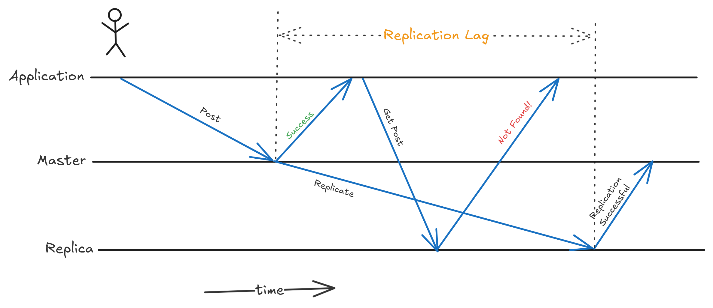
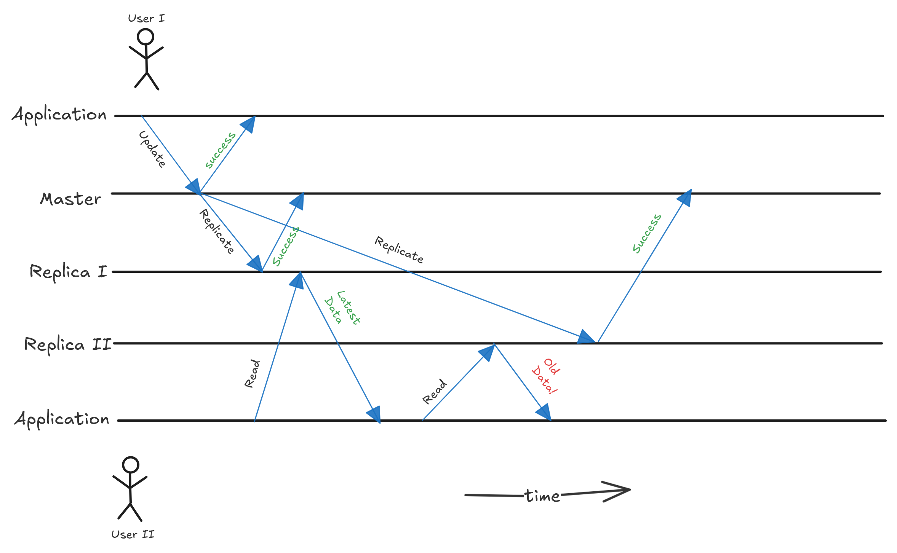

I’ve recently started reading Designing Data-Intensive Application book by Martin Kleppmann and I’m really loving it! This article is based on my notes from chapter 5 - Replication and on topic single leader-based replication.

## Why Replication?

Before this just to make sure we’re on same page, replication means having the same copy of data on multiple machines interconnected via network. Now, why do we need replication? To make our system highly available, scalable and to reduce latency! It reduces the latency by bringing the data geographically closer to the users. It makes system highly available in a way that even if some parts have failed, the data can be served from other replicas. And finally, replication favours scalability as there is more than one source to fetch the data from.

Replicating static data that won’t change is easy: copy the data to every node and you’re done. But if the data changes, you need to update the data in all of the nodes. There are three popular algorithms to do this

1. Single Leader Replication
2. Multi Leader Replication
3. Leaderless Replication

I’ll try to write my understanding about single leader replication in this article.

## Leader-based Replication

A node that stores the copy of the data is called a replica. Let’s say that a user performs a write operation on one of the replica, how do we ensure that this change is reflected in all other replicas? The most common solution is to use something called a leader-based replication (active-passive or master-slave replication).

One of the replicas is designated as a _leader_ (also known as a master or primary node). This leader is responsible for receiving all writes and propagating those changes to all other replicas, now know as _followers_ (also know as read replicas, slaves, secondary or hot standbys)_._ And these followers are only responsible for serving read requests from users and only accepts write requests write requests from the master node. Whereas the leader can serve both read and write requests.

This propagation happens in the following way: whenever the leader writes something, it also sends these changes to all of its followers as a _replication log_ or _change streams_. And the followers applies these changes in the same order as they receive.

## Synchronous vs Asynchronous Replication

The changes can be sent to the followers synchronously or asynchronously. When using synchronous replication, the user gets acknowledged only after all the replicas were updated with the changes. But in asynchronous replication the user gets acknowledgement immediately after writing to leader and the leader is responsible for propagating those changes to all the replicas in later point of time. There are actually various advantages and disadvantages to both of these methods. Let’s see what they are:

**Advantages of synchronous replication:**

1. Consistent reads: This ensures that all the followers have the most recent data. This ensures that the data read by user from any of the followers will be consistent and latest.
2. Immediate failover readiness: Whenever a leader goes down, we can still be ensured that the latest data is available on followers.

**Disadvantages of synchronous replication:**

1. Reduced write throughput: If one of the follower goes down, the leader has to wait until it’s up again before acknowledging the user about the writes.

Typically when synchronous replication is enabled, we only have one synchronous follower and all other followers were made asynchronous. This way there is at least one follower with the data up-to-date with the leader. If this synchronous goes down, one of the asynchronous follower is made synchronous. This is also called **semi-synchronous** replication.

**Advantages of asynchronous replication**:

1. Low write latency: Leader can process the write requests irrespective of the status of follower nodes.

**Disadvantages of asynchronous replication**:

1. Read inconsistency: Reads can be inconsistent if the data is read from a follower which did not yet process the writes from the leader.
2. Potential data loss: There is a risk of data loss if the leader fails immediately after acknowledging a write. The data that hasn't been replicated to any follower is lost.

Often, leader-based replication is configured to be completely asynchronous. This means that writes are not durable. This may be a bad trade-off but it is widely used if there are many followers especially if those are geographically distributed.

Now let’s see how we handle node outages.

## Handline Node Outages

We need to be able to operate even if some of the nodes go down. And to do this, we need to handle these outages efficiently to make our system highly available. How do we know if a certain node is down? The common way is to use **heartbeat mechanism**. This is a simple lightweight messages sent between nodes to indicate their respective statuses. If a certain node doesn’t send this heartbeat within a timeout period, the node is said to be down and the process of handling it is initiated. One thing to note here is that, this heartbeat delay might even be due to unreliable network.

### Handling Follower Failures

Each follower sends a heartbeat message to its leader. If the leader doesn’t receive a message from a certain follower, it is assumed to be down and the recovery process starts.

On its local disk, each follower keeps a log of the data changes it has received from the leader (replication log). When this follower goes down, this can recover quite easily by looking up the last transaction performed by it before failure and can _catch-up_ with the changes by requesting all the changes from the leader after that transaction.

### Handling Leader Failures

Similar to how followers send heartbeat messages to leader, leader sends heartbeat messages to it’s followers. If a follower fails to receive this from leader, the leader is said to be down. Each leader then waits for a certain time called **leader election timeout** period before starting the election of a new leader to avoid unnecessary leader election due to network glitches. Even if this fails, then the leader election process starts. This is complicated because not only the followers need to start sending the changes to this new leader but the clients have to be configured about this new leader to start sending write requests. This whole process is called **failover**.

So at this point, the followers are aware that the leader is down and need to start electing the new leader. This new leader can be elected using various algorithms. Few of them are:

#### Bully Algorithm

In this election process each follower is assigned a unique ID. This makes use of three messages:

1. Election: This is sent to initiate election by the node that first detects the leader failure.
2. Answer: This is a response to the election message
3. Coordinator: A victory message sent by the winner that this is the new leader now.

The algorithm works like this:

1. Whenever a followers detects a leader failure, it sends and “Election” message to all the nodes with unique ID greater than this. If there are no nodes with ID higher than this, it sends a “Coordinator” victory message and elects itself as a new leader.
2. The node above this then sends an “Answer” message to the lower node. This lower node will not take any further part in the process and just waits for the “Coordinator” victory message.
3. If the node doesn’t receive any “Answer” message, it considers the higher nodes are down and this node becomes the new leader and sends “Coordinator” message.

This is a simple and easy to implement algorithm for leader election. Works well in a system with small number of nodes. But this algorithm has high message overhead and can impact the performance in large networks.

#### Raft Algorithm

This is a consensus algorithm. Consensus means agreeing on values. It means that all nodes need to agree on a value, leader in this case. This algorithm works in the following steps:

1. If a follower doesn’t receive any message from leader even after waiting for _election timeout_ period this initiates the election process by making itself a _candidate_.
2. The candidate increments its current _term_ counter. And then requests other nodes to vote for it.
3. Each node can only vote for one candidate in one term. Also, a follower only votes for the candidate with replication log that is at least up-to-date with its own.
4. If a candidate receives the majority votes, it is elected as a leader and starts replicating the changes to the followers. The current term is said to have completed upon leader election.
5. If another candidate gets elected as leader, the loosing candidate reverts back to the follower state.

This algorithm is simple and easy to understand the Paxos (which will be discussed next).

#### Paxos Algorithm

(I couldn’t understand this and will definitely update this section)

## Propagating Replication Log

Now we need to answer next question: how to propagate changes from master to followers? Few of the most used methods are:

1. Statement-based replication (SBR): This involves sending the raw sql queries over the wire to each of the replicas. This is the simplest method among all other techniques. The disadvantage is that any non deterministic data like time and random values might change when these changes were executed by replicas.
2. Row-based replication (RBR): This involves sending the actual physical row-level changes to the replicas. This replication captures precisely what happened to the rows after a transaction. This is the default replication method in MySQL.

## Problems with Replication Lag

Replication lag is the delay between the time when data is written to the master node and the time when it is replicated to the follower nodes. This typically lies around few milliseconds to seconds. But it can go from minutes to hours in some systems. And this delay can result in very interesting problems. This mainly due to the fact that writes are only processed by the master node and reads can be processed my any of the nodes.

### Read Your Own Writes

Let’s say you posted a post on Instagram and you received an acknowledgement saying your post has been successfully published. Then you immediately refreshed the page are you see a 404 page. Where did your post go? After a while, you see your post again. Why does this happen? This is because your post was posted through master node and when you refreshed the page, the read request has been handled by a follower node that has not yet received your write request from master.

There are few solutions for this:

- When reading something that user may have modified, read it from master node or else read it from follower node. This requires some way of knowing whether something may have been modified. For example, a profile page can be modified by the user and hence when getting profile page, always read it from master.
- The above technique isn’t efficient if user can modify most of the things in the application. This blows up the master node with read requests, negating the benefit of replication. One other way is to store the last update time and let’s say for one minute after the update serve all read requests from the master node only. This one minute can be altered based on the monitored replication lag.

### Monotonic Reads

This anomaly can make user travel back in time. Let’s say user I updates their profile photo. User II tries to read this data from one of the replicas which has already received the updates from master. User II sees the updated profile photo. Then User II again refreshes the page and tries to read the profile photo but sees the old photo. This is because the second read request has been served from the replica which has not yet received the changes from the master. Monotonic reads is a guarantee that this does not happen. A simple solution is to achieve monotonic reads is to read from the same replica. This way user will always see the things in right order (even though there might be some lag).

### Consistent Prefix Reads

This is a type of guarantee that ensures that if a sequence of writes is performed in a specific order, then the reads that sees these writes are also one in the same order.
